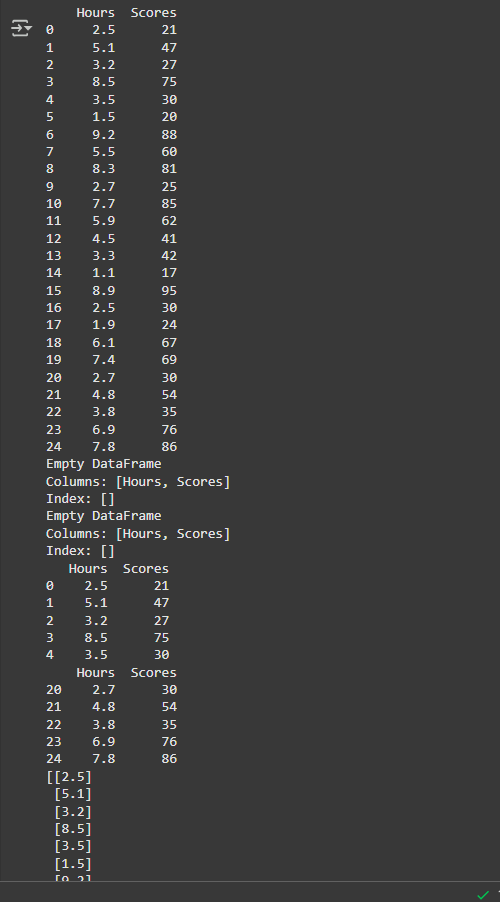
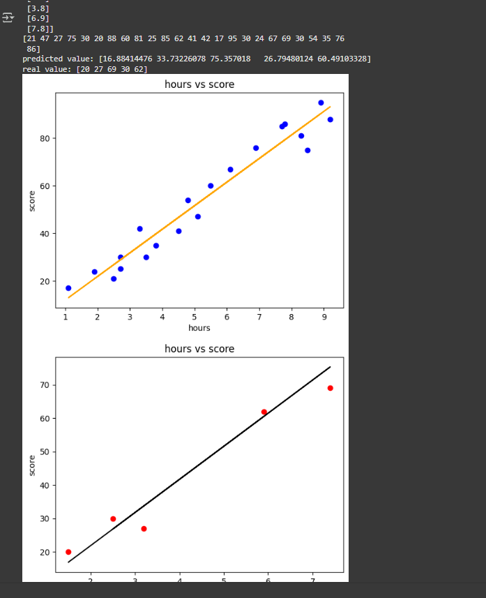

# Implementation-of-Simple-Linear-Regression-Model-for-Predicting-the-Marks-Scored

## AIM:
To write a program to predict the marks scored by a student using the simple linear regression model.

## Equipments Required:
1. Hardware – PCs
2. Anaconda – Python 3.7 Installation / Jupyter notebook

## Algorithm
1. Load the dataset (student_scores.csv).Split the data intotraining and testing sets.
2. Use the LinearRegression model from sklearn.linear_model.
3. Use the trained model to predict test data values.
4. Calculate Mean Absolute Error (MAE), Mean Squared Error (MSE), and Root Mean Squared Error (RMSE) to evaluate the model’s performance.


## Program:
```
/*
Program to implement the simple linear regression model for predicting the marks scored.
Developed by: Paul Shervin.P
RegisterNumber:212224240111
```
```
import pandas as pd
import numpy as np
import matplotlib.pyplot as plt
from sklearn.linear_model import LinearRegression
from sklearn.model_selection import train_test_split
from sklearn.metrics import mean_absolute_error,mean_squared_error
df=pd.read_csv("/content/student_scores.csv")
print(df)
print(df.head(0))
print(df.tail(0))
print(df.head())
print(df.tail())
x=df.iloc[:,:-1].values
y=df.iloc[:,-1].values
print(x)
print(y)
x_train,x_test,y_train,y_test=train_test_split(x,y,test_size=0.2,random_state=0)
regressor=LinearRegression()
regressor.fit(x_train,y_train)
y_pre=regressor.predict(x_test)
print("predicted value:",y_pre)
print("real value:",y_test)
#plot the train data
plt.scatter(x_train,y_train,color='blue')
plt.plot(x_train,regressor.predict(x_train),color="orange")
plt.title("hours vs score")
plt.xlabel("hours")
plt.ylabel("score")
plt.show()
#plot the test data
plt.scatter(x_test,y_test,color="red")
plt.plot(x_test,regressor.predict(x_test),color="black")
plt.title("hours vs score")
plt.xlabel("hours")
plt.ylabel("score")
plt.show()
mse=mean_absolute_error(y_test,y_pre)
msa=mean_squared_error(y_test,y_pre)
rmse=np.sqrt(mse)
print("mean square erro:",mse)
print("mean absolute error:",msa)
print("root mean square error:",rmse)

*/
```

## Output:



## Result:
Thus the program to implement the simple linear regression model for predicting the marks scored is written and verified using python programming.
